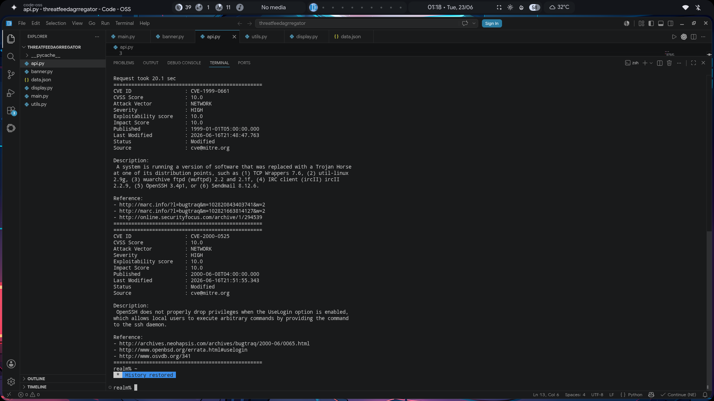

# Threat Inspector

Threat Inspector is a Python-based command-line vulnerability intelligence tool powered by the National Vulnerability Database (NVD) REST API.

It allows users to search and inspect Common Vulnerabilities and Exposures (CVEs) directly from the terminal, providing information such as CVSS scores, severity levels, descriptions, publication dates, and reference links.

---

## Features

* Search CVEs by keyword
* Retrieve vulnerability information from the NVD API
* Display CVSS scores and severity levels
* View publication and modification dates
* Display vulnerability descriptions and references
* Input validation
* Exception handling for API requests
* Graceful handling of empty search results
* Modular project structure

---

## Project Structure

```text
Threat_Inspector/
│
├── api.py
├── banner.py
├── display.py
├── main.py
├── utils.py
├── requirements.txt
├── README.md
└── screenshots/
```

---
## Screenshots

<p align="center">
  
</p>

## Installation

Clone the repository:

```bash
git clone https://github.com/avnt06/Threat_Inspector.git
cd Threat_Inspector
```

Install dependencies:

```bash
pip install -r requirements.txt
```

---

## Requirements

* Python 3.10+
* requests

---

## Usage

Run:

```bash
python main.py
```

Example:

```text
Enter keyword: openssh
How many results: 3
```

Example output:

```text
==================================================
CVE ID       : CVE-2024-6387
CVSS Score   : 8.1
Severity     : High
Published    : 2024-07-01
Last Modified: 2024-07-02

Description:
Remote code execution vulnerability in OpenSSH...

References:
https://...

==================================================
```

---

## Error Handling

Threat Inspector currently handles:

* Connection errors
* Request timeouts
* HTTP errors
* Invalid JSON responses
* Invalid user input
* Empty search results

---

## Technologies Used

* Python
* Requests
* REST APIs
* National Vulnerability Database (NVD)

---

## Future Improvements

* Search by CVE ID
* JSON export
* Logging support
* Command-line arguments with argparse
* Colored terminal output
* Configuration files
* Packaging as an installable CLI tool

---

## Disclaimer

Threat Inspector is intended for educational and informational purposes. Vulnerability information is retrieved directly from the National Vulnerability Database (NVD). Users should verify findings before relying on them in production environments.

---

## Author

**Avneet Singh**

Cybersecurity Student | Python Enthusiast | Linux User

---

## License

This project is licensed under the MIT License.
